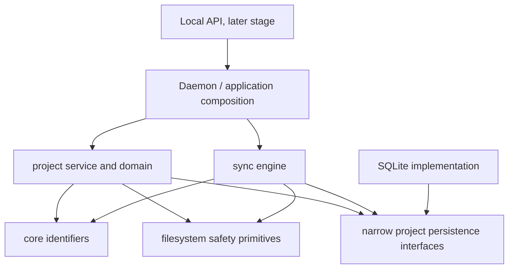

# Phase 4: Agent Project Sync Foundation

- Status: accepted
- Date: 2026-08-12
- Scope: portable agent-project records, local projections, and their boundary
  with trusted one-way synchronization

## Context

SyncGate already transports and applies authoritative file revisions between
trusted devices. Coding and automation agents need more than transferred files:
they need durable project identity, structured assignments, execution history,
handoffs, artifacts, and provenance that survive a machine, worker, or model
change.

Model context, free-form agent conversation, SQLite rows, and receiver rollback
copies cannot be the project system of record. Model context is temporary,
conversation is difficult to replay, SQLite is local-agent state, and
`.sync-history/` exists to recover overwritten destination files. Treating any
of them as canonical would make project history machine-dependent or would mix
unrelated recovery and audit guarantees.

This phase adds a project domain above the existing byte and revision sync
engine. It does not turn the sync engine into an orchestrator and does not add
remote process execution.

## Decision

### Terminology

- **Project**: a stable, provider-independent identity and collection of
  workspace content, structured work records, and artifacts managed under one
  project sync root.
- **Project sync root**: the configured share root containing `workspace/` and
  the portable `.agent-project/` control directory. It is the containment and
  one-way authority boundary for the initial implementation.
- **Workspace**: ordinary project files below `workspace/`. The sync engine
  indexes and transfers them as share content without interpreting project
  semantics.
- **Work package**: a versioned, portable assignment contract describing an
  objective, scope, dependencies, deliverables, and acceptance criteria.
- **Execution**: one bounded attempt by a worker to perform a work package. A
  work package can have multiple executions.
- **Work event**: an immutable, typed record of a project, work-package,
  execution, test, review, handoff, artifact, or acceptance transition.
- **Handoff**: a standardized immutable execution artifact that states completed
  work, changes, decisions, validation, limitations, unresolved issues,
  assumptions, follow-up work, review needs, integration considerations,
  confidence, and encountered failures.
- **Artifact**: a logical output with identity, media metadata, integrity data,
  and provenance. An **artifact blob** is its optional content-addressed byte
  representation. A hash verifies bytes; it does not establish that the bytes
  are safe or non-sensitive.
- **Provenance**: immutable references identifying the producer, work package,
  execution, source artifacts, project version, context or instruction version,
  model/provider when known, and creation time of a record or artifact.
- **Projection**: a disposable local SQLite representation of validated portable
  records, built for bounded queries and later derived processing. It is not an
  independent source of project truth.
- **Quarantine**: local-only rejection evidence or a local copy of an invalid
  candidate record. Quarantine is never authoritative and never synchronized.
- **Project authority**: the single configured source device/share permitted to
  create the portable history for a project in this phase.
- **Project replica**: a receiver-side copy transported from the authority. A
  replica may validate, project, and query records but cannot create a competing
  canonical history in this phase.

### Portable directory records are canonical

The project authority writes versioned records under this layout:

```text
<ProjectSyncRoot>/
  workspace/
  .agent-project/
    manifest.json
    history/events/YYYY/MM/DD/<event-id>.json
    work-packages/<work-package-id>/definition.json
    executions/<execution-id>/manifest.json
    executions/<execution-id>/handoff.json
    executions/<execution-id>/results/
    artifacts/manifests/<artifact-id>.json
    artifacts/blobs/sha256/<content-hash>
    local/
      quarantine/
```

Everything below `.agent-project/` is portable except
`.agent-project/local/`. Mandatory project safety rules also exclude `.git/`,
existing `.sync-history/` and `.sync-incoming/` directories, and partial
transfer files. Generic shares remain valid and do not become projects
implicitly.

Portable files are canonical because they travel with the project, can be
validated without a running database, and can reconstruct local query state on
any compatible replica. The initial one-way source remains authoritative for
both workspace and portable project records. Project records do not override
receiver authorization, deletion guards, path safety, or apply recovery.

SQLite stores project registration, validated event and artifact projections,
and ingestion checkpoints. The database is local to one daemon and may be
deleted or reset without deleting canonical project history. A rebuild starts
from the root manifest, discovers only canonical control paths, validates each
record and its project identity, orders state using record fields rather than
directory traversal order, and transactionally recreates the projection.

### History types remain separate

| Datum | Owner and location | Authority | Recovery purpose |
|---|---|---|---|
| Workspace content | Project sync root | One-way source and sync revisions | Current project files |
| Project manifest, work records, handoffs, and artifact manifests/blobs | `.agent-project/` on the project authority | Portable directory record | Durable agent work history and provenance |
| Project projection and ingestion checkpoint | Local SQLite | Derived from validated portable records | Bounded local queries and resumable ingestion |
| File revisions and tombstones | Local SQLite sync tables | Existing sync engine | File ancestry and deletion propagation |
| Preserved destination copies | `.sync-history/` on a receiver | Existing receiver apply service | Filesystem rollback and conflict preservation |
| Operational and security audit events | Local SQLite `audit_events` | Local daemon operation | Authorization and operator audit |
| Quarantine evidence | `.agent-project/local/` or the local data directory | Local validator only | Diagnose rejected input without distributing it |
| Temporary writes | Same-volume temporary paths | No durable authority | Atomic publication and interrupted-write recovery |

A work event may carry an allowlisted correlation to a sync revision or audit
event. Correlation does not copy authority: an audit row does not prove work was
accepted, and a work event does not prove a network action was authorized.

### Immutable records and atomic publication

Portable events and manifests use one record per file. A shared append-only
JSONL file is rejected because concurrent or interrupted synchronized appends
have ambiguous partial-write and conflict semantics.

Writers validate and serialize a complete record before publication. They write
to a restrictive same-directory temporary file, flush and close it, and publish
it with a no-overwrite atomic rename or the closest fail-closed platform
primitive. The final filename is derived from the validated record identity,
not caller-controlled path text. Temporary files are not authoritative and are
ignored by discovery.

An existing record with the same identity and identical canonical hash is an
idempotent replay. The same identity with different content is a collision and
is rejected. Accepted files are never edited in place. Corrections use a new
record with an explicit causal reference.

Record integrity uses a documented canonical JSON representation. When a record
contains its own integrity value, the hash is calculated over the canonical
document with that integrity field excluded; the full rule belongs to the
versioned on-disk contract. Artifact blobs use SHA-256 content addressing.

### Versioning and compatibility

Every portable record has a schema family and major/minor version. A major
version changes required meaning or invariants and is rejected until supported.
Within a supported major version, a minor version may add optional fields but
cannot remove, rename, or reinterpret existing fields. Readers enforce size
limits, all known required fields, record-kind constraints, and security
invariants while tolerating bounded unknown additive fields.

Unknown record kinds and event types are not projected merely because their JSON
shape parses. They remain unaccepted until the implementation defines their
state and privacy semantics. Original portable bytes remain unchanged; local
projection code records its supported contract and can rebuild after an
upgrade.

### Privacy defaults

Work records use typed, allowlisted payloads. Raw prompts, terminal output,
environment variables, tool transcripts, free-form logs, credentials, private
keys, pairing secrets, bearer tokens, and arbitrary file contents are excluded
by default. Absolute local paths are not part of portable references or query
results. Relative paths still reveal project structure and therefore remain
sensitive project metadata.

Redaction is defense in depth, not authorization to capture arbitrary text.
Callers must supply only fields allowed by the record contract. Content-addressed
artifacts require the same sensitivity decision as ordinary synchronized files.

### Failure and recovery

- A crash before final rename leaves only a non-authoritative temporary file;
  discovery ignores it and local cleanup may remove it after validation.
- A crash after portable publication but before SQLite commit leaves canonical
  data intact; the next ingestion or rebuild projects it.
- A crash after SQLite commit but before checkpoint advancement replays the
  record idempotently and then advances the checkpoint.
- A missing or corrupt project projection is rebuilt from the manifest and
  portable records. Projection-only rows that have no canonical record cannot
  survive a clean rebuild.
- Out-of-order records are validated independently and held as unresolved local
  projection state when their references are not yet present. Later ingestion
  reconciles them without inventing the missing record.
- Invalid, oversized, unsupported, project-mismatched, or hash-conflicting input
  is rejected. The receiver does not automatically delete or move the portable
  candidate, because that would mutate synced authority. It records sanitized
  local rejection evidence and may make a bounded local-only quarantine copy.
- An unavailable project root preserves the last known local projection but
  marks it stale; absence is not interpreted as canonical deletion.

### Dependency direction and ownership



The project domain owns portable layout, contracts, validation, state
transitions, ingestion semantics, and projection rebuild rules. The storage
boundary owns narrow persistence interfaces; SQLite implements them. The daemon
owns the live store and composes project and sync services. The API may later
call daemon-owned application services but cannot open SQLite or inspect project
files directly.

The sync engine remains semantic-blind: it scans, revisions, authorizes,
transfers, and safely applies bytes. `internal/sync` must not import
`internal/project`. Project lifecycle hooks are invoked by the daemon or an
application coordinator after a successful local write, scan, or apply.

## Consequences

- A compatible device can reconstruct structured project history without the
  originating SQLite database or model conversation.
- File rollback history, security audit history, and agent work history retain
  distinct guarantees and retention policies.
- Immutable files make replay and lineage clearer but use more directory entries
  and require explicit correction events.
- The initial single authority avoids undefined merge behaviour but prevents a
  replica from contributing canonical history directly.
- Metadata and artifact synchronization expand the sensitivity of a project
  share; existing share authorization remains the outer access boundary.
- Projection logic must remain deterministic and version-aware because SQLite
  cannot repair ambiguity in canonical records.

## Deferred

Stages 8 through 10 subsequently delivered deterministic insights, the local
administration API, safe existing-share migration, and the two-daemon release
gate while preserving this decision's ownership boundaries. The following
remain deferred and are not implemented or authorized:

- Multi-writer or two-way project history and automatic conflict resolution.
- Agent execution, remote commands, task scheduling, or work assignment.
- Project Context Compiler, trade registry, embeddings, predictive routing, or
  LLM-generated retrospectives.
- Dashboard/UI work, Git worktree orchestration, or automatic raw transcript
  capture.

## Rejected alternatives

- **SQLite as canonical project history** would bind recovery and portability to
  one daemon's database and make synchronized reconstruction incomplete.
- **Git history as the only project history** would omit uncommitted executions,
  tests, handoffs, rejected work, and provider-independent provenance while
  requiring Git semantics from the sync layer.
- **Operational audit events as work events** would mix authorization evidence
  with product state and encourage sensitive, unbounded audit metadata.
- **`.sync-history/` as work history** would confuse receiver rollback copies
  with intentional project records and expose implementation-specific paths.
- **One mutable event log file** would make atomic cross-device appends and
  partial-write recovery difficult.
- **Immediate multi-writer records** would require conflict, causality, and
  authority rules that the current one-way product does not provide.
- **Raw prompt and tool transcript capture** would create a high-volume secret
  and privacy boundary before retention and access controls exist.
