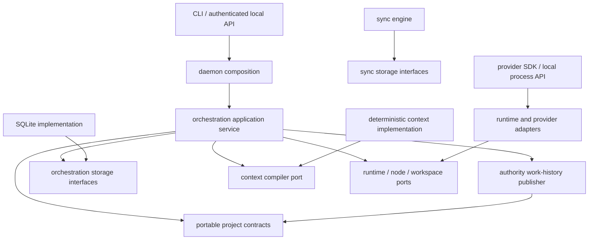

# Phase 5: Orchestration Domain and Authority

- Status: accepted
- Date: 2026-08-16
- Scope: provider-independent orchestration identities, ownership classes,
  authority, compatibility, and dependency boundaries

## Context

The Agent Project foundation already has a portable single-authority source of
truth for projects, work packages, execution attempts, tests, handoffs,
artifacts, reviews, and acceptance. It also has a typed work-history service,
deterministic local projection, descriptive insights, and an authenticated
daemon-owned administration boundary.

Orchestration needs tasks, graph revisions, trades, worker configurations,
context and instruction bundles, execution contracts, assignments, leases,
runtime and node bindings, result intake, and quality gates. Treating all of
that state as portable history would expose machine-local details and make
leases race through one-way sync. Treating all of it as SQLite control state
would create a second task system of record that cannot be reconstructed from
the project. Letting a worker publish work events directly would also make an
untrusted runtime a project authority.

This decision defines the vocabulary and ownership boundary before any new
record kind, table, handler, workspace allocator, or runtime adapter ships. It
does not enable production execution.

## Decision

### One canonical work vocabulary

The existing Agent Project types remain authoritative:

- `WorkPackageDefinition` is the executable unit of project intent.
- `ExecutionManifest` is the identity of one bounded attempt.
- `WORK_PACKAGE_*`, `EXECUTION_*`, `TEST_RECORDED`, `HANDOFF_CREATED`,
  `REVIEW_RECORDED`, `ARTIFACT_RECORDED`, and `WORK_ACCEPTED` are the
  canonical transition vocabulary.
- `workhistory.Service` remains the authority-side publication boundary.
- Portable records plus their deterministic reducer define observable project
  work state. SQLite projections are not an independent event log.

A task groups and versions work packages; it does not replace them. There will
be no parallel `AGENT_*` transition log, mutable portable task row, or second
canonical execution state machine. Authority-local assignments and leases may
explain what the scheduler is doing, but they cannot make a work package
accepted, failed, canceled, or otherwise canonically changed.

### Ownership classes

Every orchestration field belongs to exactly one class. A value copied from one
class into another is a new allowlisted snapshot field, not shared ownership.

| Class | Meaning | Durability and authority |
| --- | --- | --- |
| **P: portable canonical project record** | Project intent, immutable accepted history, stable resolved provenance references | Published only by the project authority through Agent Project contracts; synchronized and replayable |
| **L: authority-local durable control state** | Registries, policies, immutable execution contracts, assignments, leases, intake decisions, and audit needed for restart | Stored behind orchestration persistence interfaces; not synchronized and not canonical project state |
| **R: rebuildable projection or derived cache** | Read models, readiness, indexes, compiled context bytes, and descriptive calculations reproducible from declared inputs | May be deleted and rebuilt; never authorizes work by itself |
| **E: local ephemeral runtime/workspace state** | Processes, sessions, health samples, capacity observations, temporary credentials, worktree paths, handles, and staging | Lost or reconciled after restart; never portable and never returned through public APIs as a local handle |
| **G: optional generated artifact candidate** | Generated briefing, retrospective, report, patch, or other non-authoritative content proposed for retention | Requires explicit provenance and authority approval; only an accepted publication creates a P-class artifact manifest/blob |

`.git` metadata, credentials, secrets, local caches, quarantine bytes, process
IDs, absolute paths, provider sessions, runtime handles, workspace handles, and
lease tokens are never P-class fields.

### Identifier and version rules

Existing project, record, work-package, execution, handoff, artifact, device,
share, revision, transfer, and audit identifiers keep their current meaning.
They are not renamed or overloaded.

New logical identities use a lowercase namespace and an opaque value, such as
`task:<opaque>`, `trade:<opaque>`, `worker:<opaque>`, `runtime:<opaque>`,
`provider:<opaque>`, `model:<opaque>`, `node:<opaque>`, `context:<opaque>`,
`instruction:<opaque>`, `contract:<opaque>`, `assignment:<opaque>`,
`lease:<opaque>`, `result:<opaque>`, and `gate:<opaque>`. New code validates
them with the existing bounded identifier alphabet and length rules. Callers
must treat the opaque portion as non-semantic.

Versioned definitions carry all of:

- a stable logical ID;
- a positive aggregate-local version or revision number;
- a schema family and major/minor version;
- a canonical SHA-256 content digest; and
- an optional predecessor version and digest where the definition forms a
  revision chain.

The same logical ID and version with the same digest is an idempotent replay.
The same logical ID and version with different content is a conflict. Revisions
are immutable; amendment creates a new version. Missing predecessors, forks,
and stale expected revisions fail closed. A display name, provider session ID,
model marketing name, branch name, absolute path, or database row ID is never a
logical orchestration identity.

### Aggregate field classification

The following tables are exhaustive for the Slice 1 aggregate vocabulary.
Later fields require an ADR amendment and an explicit class before they ship.

#### Task and graph

| Aggregate | Fields | Class | Rules |
| --- | --- | --- | --- |
| Task revision | schema, record ID, project ID, task ID, task revision, predecessor revision/digest, objective, priority, risk dimensions, resource constraints, graph revision reference, quality-gate references, created time, provenance, integrity digest | P | Immutable project intent published by the authority |
| Dependency graph revision | project ID, task ID/revision, graph revision, predecessor graph revision/digest, ordered member work-package definition record IDs/digests, dependency-set digest, synchronization-barrier member IDs, content digest, created time, provenance | P | Membership is canonical here; edges are read from the referenced work-package definitions and committed by digest, not declared a second time |
| Work-package extension | task ID/revision, graph revision, priority, risk dimensions, resource constraints, quality-gate references | P | Additive versioned extension to `WorkPackageDefinition`; existing objective, trade, scope, dependencies, deliverables, criteria, review flag, time, and provenance remain P |
| Task/readiness read model | task status summary, work-package readiness, blocking explanation code, parallel-ready set, graph watermark, projection version | R | Deterministically reduced from P records and events; never model-authored |

Task status is derived from member work packages and canonical events. The task
record contains no mutable `status`, assigned worker, lease, process, cost, or
runtime session field.

`WorkPackageDefinition.Dependencies` remains the only authored dependency-edge
source. A graph revision binds exact immutable work-package definition records,
sorts and hashes their dependency edge set, and records that digest. A mismatch
between the definitions, graph digest, task ID/revision, graph revision, or
barrier membership rejects the graph. It is never resolved by preferring one
copy. This preserves one dependency vocabulary while still giving the task an
immutable graph watermark.

#### Trade, worker, and instruction registry

| Aggregate | Fields | Class | Rules |
| --- | --- | --- | --- |
| Trade definition | trade ID/version, lifecycle, name, description, required/optional capability tags, specialization tags, evidence metadata schema, definition digest, predecessor, created/updated audit identity | L | Provider-independent reusable definition; project adaptations are scoped by project ID but remain local |
| Worker profile | worker ID/profile version, lifecycle, trade ID/version, specialization tags, instruction ID/version, runtime/provider/model references, tool-policy reference, project adaptation scope, evidence metadata, definition digest, predecessor, created/updated audit identity | L | Distinct configurations remain distinct even when they use the same model |
| Instruction definition | instruction ID/version, lifecycle, trade/worker applicability, structured instruction sections, tool-policy references, privacy class, definition digest, predecessor, created/updated audit identity | L | No credential values, raw environment, or provider session data |
| Registry import/export candidate | definition type, logical ID/version, canonical bytes, digest, provenance, conflict result | G | Import validates into L; export is not project truth unless separately accepted as an artifact |
| Resolved execution provenance | trade ID/version, worker ID/profile version, instruction ID/version, specialization tags, provider/model reference | P | Allowlisted immutable snapshot attached to execution/history; no registry body or secret configuration |

Unknown evidence remains unknown. Registry records may store observed evidence
references but cannot invent a rank, cost, duration, success rate, or capability.

#### Runtime, provider/model, and compute node

| Aggregate | Fields | Class | Rules |
| --- | --- | --- | --- |
| Runtime adapter definition | runtime ID/version, adapter kind, lifecycle, declared capabilities, supported contract/result schema versions, resumability behavior, configuration schema, definition digest, audit identity | L | Provider-neutral orchestration contract; no credentials |
| Provider reference | provider ID/version, adapter kind, declared regions/features, configuration schema, definition digest, audit identity | L | A reference, not an account secret or live session |
| Model reference | model ID/version, provider reference, declared context/tool capabilities, lifecycle, definition digest, audit identity | L | Marketing aliases may be metadata but not identity |
| Compute-node definition | node ID/version, lifecycle, OS/architecture, declared capacity, installed-tool inventory digest, repository access class, available runtime IDs/versions, lease limits, definition digest, audit identity | L | Stable declared inventory only |
| Node observation | health, observed free capacity, tool probe results, connectivity, clock sample, last-seen time | E | Bounded and expiring; cannot silently amend the L definition |
| Runtime binding snapshot | runtime/provider/model/node IDs and exact versions, capability-negotiation result, binding digest | L | Bound into an immutable execution contract; an allowlisted identity/digest snapshot is P provenance |
| Runtime/session state | provider session ID, process ID, OS handle, connection, temporary token, live status sample, local error details | E | Opaque outside the adapter and sanitized at boundaries |
| Credential material | private keys, bearer/API tokens, secret values, credential-store handles | E | Values live in approved credential facilities; even opaque handles are excluded from portable records and public responses |

A declared capability is not proof of current availability. Scheduling must use
the intersection of the durable declaration, current bounded observation, and
execution policy, then fail closed if any required capability is unknown.

#### Context and instruction bundles

| Aggregate | Fields | Class | Rules |
| --- | --- | --- | --- |
| Context compile request | context ID/version, project/task/work-package/trade references, explicit source manifest, privacy classes, redaction policy version, size/token budgets, compiler version | L | Immutable input selected by authority policy |
| Context bundle cache | structured index, briefing bytes, source digests, omissions, warnings, stable ordering, compiler version, context digest | R | Rebuildable only from the exact compile request and unchanged declared sources |
| Context provenance snapshot | context ID/version, context digest, compiler version, source-manifest digest, omission/warning counts | P | Allowlisted metadata only; no cache bytes, absolute paths, secrets, or raw environment |
| Generated context artifact | allowlisted briefing or manifest proposed for publication, provenance, media type, content digest | G | Becomes a P artifact only after authority review/publication |
| Instruction bundle resolution | instruction ID/version, definition digest, rendered digest, renderer version | L | Exact resolution bound into the execution contract |
| Instruction provenance snapshot | instruction ID/version and rendered digest | P | No instruction body unless separately approved as an artifact |

If an input cannot be reproduced, the cache is not described as rebuildable and
the authority must retain the necessary L-class input or fail contract replay.

#### Execution contract, assignment, and lease

| Aggregate | Fields | Class | Rules |
| --- | --- | --- | --- |
| Execution contract | contract ID/version, schema, project/task/work-package/execution and graph revisions, project revision, worker/trade/instruction/context/runtime/provider/model/node bindings, effective permission set, path scopes, budgets, deadlines, deliverables, acceptance criteria, required quality gates, retry/cancellation policy, content digest, predecessor/amendment reference, created time and actor | L | Immutable exact authority granted to one execution; amendments create a new version |
| Execution provenance snapshot | contract ID/version/digest plus resolved worker/trade/context/instruction/runtime/provider/model/node identities and versions | P | Allowlisted identity and digest evidence; full permissions, local policy, node details, and deadlines stay local unless a later contract explicitly promotes them |
| Assignment | assignment ID, contract reference/digest, execution ID, selected worker/node/workspace IDs, state, attempt number, idempotency key digest, created/updated times, failure/recovery code | L | Operational scheduler state; cannot change canonical work state |
| Lease | lease ID, assignment/execution ID, owner node/runtime, generation/fencing token digest, acquired/renewed/expires times, state, recovery code | L | Mutable only through compare-and-swap/fencing rules; never synchronized or portable |
| Live lease holder | in-memory lock, timer, cancellation function, process/session/workspace handle | E | Reconciled against L state after restart |
| Assignment/readiness projection | queue position, ready reason, active lease summary, retry availability, sanitized failure explanation | R | Derived from P and L with a recorded watermark; not a source of truth |

The lease token itself is a local secret-bearing capability and remains E. L
stores only a comparison/fencing value sufficient for restart and stale-writer
rejection. A lease expiry never publishes a canonical execution failure by
itself; authority policy must validate recovery and explicitly record any work
transition.

#### Result intake and quality gates

| Aggregate | Fields | Class | Rules |
| --- | --- | --- | --- |
| Result envelope | result ID, envelope schema/version, idempotency key digest, project/task/work-package/execution/contract/assignment bindings, worker/runtime/node identity claims, patch/artifact/handoff/test/telemetry references and digests, claimed outcome, created time, envelope digest | L | Immutable untrusted input retained for idempotency and audit; never a work event |
| Result payload staging | patch bytes, candidate artifact bytes, logs or other approved upload objects, temporary paths and handles | E | Bounded, isolated, scanned/validated by type, and removed only under retention policy |
| Result-intake decision | result ID/digest, validation version, accepted/rejected state, reason codes, canonical record IDs produced, reviewer/gate references, decision time and actor | L | Same ID/same digest is idempotent; same ID/different digest is conflict |
| Accepted result projection | sanitized intake status, produced record IDs, reason codes, evidence watermark | R | Rebuildable from L intake state and P records where defined |
| Quality-gate definition | gate ID/version, lifecycle, gate type, applicability, required evidence schema, evaluator identity/policy, pass/fail/waive rules, definition digest, audit identity | L | Deterministic policy or explicit human/reviewer gate; no hidden model judgment |
| Quality-gate requirement | gate ID/version/digest, required/optional state, risk rationale | P | Referenced by task/work-package intent and snapshotted in the L contract |
| Quality-gate run state | evaluator session/process handle, temporary evidence, progress, local errors | E | Cannot publish acceptance directly |
| Accepted gate evidence | allowlisted test, review, artifact, handoff, acceptance event, evaluator identity/version, evidence digest | P | Published only through existing typed event/artifact contracts |
| Generated review/retrospective | proposed content, generator identity/version, source digests, confidence/limitations | G | Non-authoritative until explicitly approved; cannot satisfy a gate by itself |

Raw prompts, terminal output, tool transcripts, environment values, and
arbitrary logs are not fields in the result envelope. A later opt-in capture
release requires its own consent, encryption, access, redaction, retention, and
deletion decision.

### Authority and result-intake protocol

Only the device/share named by the project manifest may publish canonical task,
work-package, execution, event, handoff, or artifact records. Local possession
of project bytes, a worker identity, a valid result-envelope digest, or a runtime
lease does not grant that authority.

The intake sequence is:

1. The authority creates an immutable L execution contract and assignment.
2. A runtime receives no more than that contract and an opaque workspace.
3. The worker/runtime returns an immutable result envelope and bounded staged
   objects. It does not write `.agent-project/` directly.
4. The authority validates schema, project and execution binding, contract
   digest, worker/runtime/node identity, idempotency, scopes, content digests,
   budgets, required gates, and privacy allowlists.
5. Invalid or unsupported input creates only sanitized L rejection evidence.
6. Accepted subsets are converted by authority-owned services into existing
   typed P events, handoffs, and artifact records. Worker-claimed success is not
   `WORK_ACCEPTED`; the normal review and acceptance transition still applies.
7. Repeating the same result ID and digest returns the prior intake decision.
   A conflicting digest fails closed and publishes no new canonical record.

A future upload-only return share may transport envelope and artifact bytes to
the authority. Its receiver authorization permits upload, not project-history
publication. Sync and transport do not invoke runtime actions or interpret the
result as accepted work.

### Permission and gate authority

An L execution contract contains the intersection of project policy, task and
work-package scope, trade policy, worker/tool policy, runtime/node capability,
and explicit user grants. A missing or unknown capability is denied. A worker
cannot broaden authority through a result, handoff, requested tool call, or
provider feature.

Quality-gate references in P intent are stable requirements. L registry
definitions contain local evaluation policy. If the exact referenced gate,
trade, worker, instruction, runtime, provider/model, or node definition is
missing, disabled, conflicting, or unsupported, scheduling fails closed. A
replica can still validate and project canonical history without possessing the
authority's local registry.

### Schema evolution and mixed versions

Portable orchestration additions use the existing
`syncgate.agent-project` family and its per-record major/minor scheme. A new
record kind, event type, or closed payload is not treated as understood merely
because its major/minor number parses. Its state, authority, and privacy
semantics require explicit reader support and contract tests.

Rules for portable records are:

- additive optional fields with unchanged meaning may advance the minor
  version;
- new record kinds and event types require a minor-version contract update,
  explicit discovery paths, bounds, validation, projection semantics, and
  golden fixtures before publication;
- removal, reinterpretation, weakened validation, or authority changes require
  a new major version and migration plan;
- unknown families, unsupported majors, record kinds, events, or closed
  payloads are rejected from projection and cannot affect readiness,
  assignment, gates, or acceptance;
- original canonical bytes remain untouched, and a later compatible daemon
  recovers by rescanning and rebuilding from those bytes;
- same-ID/different-content remains a conflict across every version.

An older semantic-blind sync daemon may transport newer portable bytes while
projecting only record kinds it understands. It must not claim orchestration
readiness or execute work. An orchestration authority must verify exact local
support for every record, registry, contract, and result-envelope version
before scheduling. Downgrading an authority data directory after an
orchestration storage migration is unsupported and must fail on the local
storage version gate rather than partially operate.

Result envelopes, registry imports, execution contracts, runtime protocols,
and context caches use their own named schema families and versions because
they are not portable project records. Intake accepts only explicitly supported
major versions. Unsupported input is retained or quarantined according to
local policy, records a sanitized reason, publishes no P state, and can be
retried after upgrade with the same identity and digest.

### Dependency direction

The dependency rules are:

- `internal/project` owns portable records and validation and cannot import
  orchestration, runtime, provider, node, workspace, API, daemon, sync, or
  SQLite packages.
- `internal/sync` remains semantic-blind and cannot import project,
  orchestration, runtime, or provider packages or start processes.
- Provider SDKs and secret-bearing configuration exist only in adapter and
  credential boundaries. Provider types do not enter project records,
  validation, scheduler policy, or API DTOs.
- The orchestration application depends on narrow runtime, node, workspace,
  context, storage, and work-history ports. Adapters implement those ports and
  are composed by the daemon.
- API handlers call daemon-owned application services. They do not open
  SQLite, inspect roots, access provider sessions, or publish portable files.
- Runtime and workspace adapters receive opaque IDs at public boundaries;
  absolute paths and handles remain E-class implementation details.

Architecture-boundary tests must make these imports machine-checkable before a
production adapter is enabled.

## Failure and recovery

- Loss of R state triggers deterministic rebuild from its declared P and L
  inputs at a recorded watermark.
- Loss of E state triggers reconciliation: observe the adapter/node/workspace,
  fence stale leases, and either resume through an idempotency key or require an
  explicit recoverable failure decision. Never infer canonical success.
- A crash after result bytes arrive but before the L intake decision revalidates
  the same envelope and digest. A crash after P publication but before the L
  decision reconciles produced record IDs through idempotent publication.
- A corrupt or missing L execution contract prevents resume and intake. P
  history is preserved, but the execution requires an explicit failure or
  operator recovery path; it is not reconstructed with broader defaults.
- Missing registry definitions, capability drift, expired leases, unsupported
  schemas, and unavailable nodes block scheduling with stable reason codes.
- Canonical record publication never rolls back to match SQLite, an assignment,
  a lease, a provider session, or a worker claim.

## Security consequences

- File synchronization cannot become a hidden remote shell because runtime
  actions live behind a separate contract and composition boundary.
- A compromised worker can still propose malicious patches, artifacts, tests,
  telemetry, or success claims. Authority validation and quality gates reduce
  but do not eliminate reviewer and supply-chain risk.
- L registries and contracts are security-sensitive local state. They require
  access control, audit, backup/recovery guidance, and migration tests even
  though they are not canonical project history.
- Portable provenance exposes resolved worker, trade, provider/model, context,
  instruction, node, contract, and gate identities. Values must remain
  allowlisted and are sensitive project metadata.
- Provider-neutral interfaces reduce lock-in but do not make provider runtimes
  equivalent security sandboxes.

## Deferred

This decision does not authorize or implement:

- a production runtime adapter, remote command endpoint, or distributed node;
- runtime allocation, Git worktree creation, or automatic merge;
- multi-writer or two-way project history;
- automatic conflict resolution or acceptance;
- embeddings, semantic retrieval, learned routing, ranking, predictions, crew
  recommendations, or LLM-authored canonical state;
- raw prompt, terminal, environment, tool transcript, or arbitrary log capture;
  or
- browser, mobile, relay, coordinator, or remote administration control.

Multi-writer history remains behind a separate ADR defining writer authority,
causality, collision resolution, signatures/attestation, convergence, rollback,
and downgrade behavior. No result-envelope or upload-only mechanism is a
shortcut around that decision.

## Rejected alternatives

- **Portable assignments and leases** would propagate stale machine-local
  ownership through one-way sync and permit split-brain execution.
- **SQLite as the task source of truth** would create a second work state that
  cannot be rebuilt from canonical project records.
- **Worker-authored work events** would let a compromised runtime claim review
  or acceptance and weaken the single-authority contract.
- **Provider sessions as execution identity** would couple history to one
  vendor and make retries and provider changes ambiguous.
- **A second `AGENT_*` event vocabulary** would duplicate work-package and
  execution transitions and allow reducers to disagree.
- **Embedding full execution contracts in portable history** would expose local
  paths, policies, capacity, and security details while making local amendment
  and revocation semantics misleading.
- **Treating minor versions as automatic support** would allow unknown record
  or payload semantics to affect readiness without validation.
- **Using sync capabilities as runtime permissions** would turn byte transport
  authorization into an undeclared remote-execution capability.
