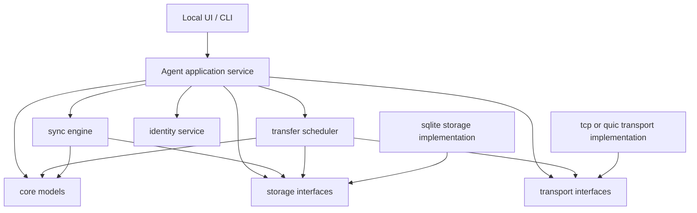

# Architecture Overview

## Product Shape

Private Sync Gate is a local-first file transfer and synchronization platform. Each trusted computer runs an agent. The agent owns local indexing, revision tracking, transfer scheduling, authorization, and a local administration API. Network transports are replaceable implementations behind a stable session interface.

The system is not a backup replacement. Sync features can propagate mistakes, malware, and deletions, so destructive-change protections and version history are part of the core design.

For multi-computer coding or automation agents, the sync gate coordinates shared workspaces, task manifests, handoff folders, logs, and outputs. It does not provide arbitrary remote shell execution in the sync layer.

## Initial Architecture

The initial agent is split into these domains:

- `internal/core`: shared identifiers, revisions, capabilities, and transfer states.
- `internal/transport`: peer session abstraction. Implementations may later include manual TCP/TLS, QUIC, LAN discovery, relay, or overlay transport.
- `internal/storage`: persistence interfaces. SQLite will be the first concrete implementation.
- `internal/transfer`: transfer state machine and scheduler contracts.
- `internal/sync`: future folder scan, manifest, one-way sync, tombstone, and conflict logic.
- `internal/identity`: device key generation, fingerprinting, and production Windows credential storage; pairing follows in a later slice.
- `cmd/syncgate`: future foreground agent entry point.

The sync domain must not import concrete transport, SQLite, UI, coordinator, relay, or platform-specific packages.

## Dependency Direction



## Trust Boundaries

- Local machine boundary: the agent can access configured share roots and its local database.
- Trusted device boundary: paired devices authenticate as stable public-key identities.
- Share boundary: every request is authorized against the receiving device's share capabilities.
- Transport boundary: direct, overlay, and relay transports provide streams but do not decide sync policy.
- Coordinator boundary, later: presence and connection metadata only.
- Browser portal boundary, later: short-lived, user-scoped access to explicit virtual shares.

## Non-Goals For Early Phases

- Public multi-user hosting.
- Arbitrary remote shell access.
- Filesystem mounting.
- Mobile apps.
- Full NAT traversal.
- Automatic conflict merging.
- Custom cryptography.
- Backup replacement claims.

## Package Structure

```text
cmd/
  syncgate/
internal/
  core/
  identity/
  storage/
  sync/
  transfer/
  transport/
docs/
  adr/
  architecture/
  diagrams/
  protocol/
  threat-model/
```
