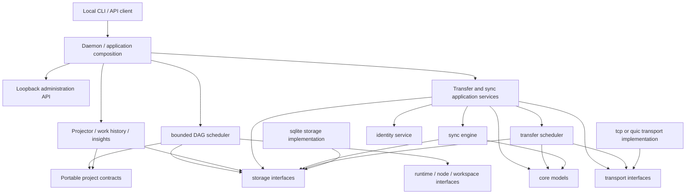

# Architecture Overview

## Product Shape

Private Sync Gate is a local-first file transfer and synchronization platform.
Each trusted computer runs an agent. The agent owns local indexing, revision
tracking, transfer scheduling, authorization, Agent Project projection, and a
local administration API. Network transports are replaceable implementations
behind a stable session interface.

The system is not a backup replacement. Sync features can propagate mistakes, malware, and deletions, so destructive-change protections and version history are part of the core design.

For multi-computer coding or automation agents, the sync gate coordinates shared workspaces, task manifests, handoff folders, logs, and outputs. It does not provide arbitrary remote shell execution in the sync layer.

## Initial Architecture

The initial agent is split into these domains:

- `internal/core`: shared identifiers, revisions, capabilities, and transfer states.
- `internal/transport`: peer session abstraction. The direct TCP implementation uses paired mutual TLS; future implementations may include QUIC, LAN discovery, relay, or overlay transport.
- `internal/storage`: persistence interfaces implemented locally by SQLite.
- `internal/transfer`: transfer state machine and resumable transfer contracts.
- `internal/sync`: folder scanning, revision manifests, one-way planning and apply, tombstones, deletion guards, jobs, and watcher scheduling.
- `internal/identity`: device key generation, signed pairing invitations, fingerprints, and production Windows credential storage.
- `internal/pairing`: explicit pairing acceptance, least-privilege grants, audit, and revocation workflows.
- `internal/project`: provider-independent portable Agent Project contracts, validation, layout, and immutable publication.
- `internal/projector`: deterministic ingestion from canonical project records into rebuildable storage projections.
- `internal/workhistory`: typed, idempotent authority-side creation of canonical work records.
- `internal/insights`: versioned descriptive calculations over accepted projected history.
- `internal/orchestration`, `internal/registry`, `internal/contextcompiler`, and `internal/executioncontract`: deterministic task readiness, registry, context, least-privilege contract, and authority-local control logic.
- `internal/runtimecontract`, `internal/codexruntime`, `internal/computenode`, `internal/workspace`, and `internal/resultintake`: provider-neutral interfaces, an opt-in supervised Codex CLI adapter, and untrusted-result validation; the shipped daemon keeps execution and workspace allocation disabled.
- `internal/scheduler`: opt-in daemon-owned DAG dispatch, bounded parallelism,
  lease/workspace/runtime composition, and recovery inspection; it stops at
  untrusted result collection and cannot publish canonical project history.
- `internal/api`: authenticated loopback administration contracts and handlers.
- `internal/daemon`: application composition, lifecycle, local API ownership, share runtimes, and shutdown ordering.
- `cmd/syncgate`: foreground daemon and local operator commands.

The sync domain must not import concrete transport, SQLite, UI, coordinator,
or relay packages. OS-specific watcher and filesystem implementations stay
behind the sync package's cross-platform interfaces and build constraints.

## Dependency Direction



The portable `project` package does not depend on runtime providers, SQLite,
the API, daemon composition, or sync semantics. The sync package remains
semantic-blind to Agent Project records and cannot start an agent runtime.

## Trust Boundaries

- Local machine boundary: the agent can access configured share roots and its local database.
- Trusted device boundary: paired devices authenticate as stable public-key identities.
- Share boundary: every request is authorized against the receiving device's share capabilities.
- Transport boundary: direct mutual TLS authenticates paired device keys and encrypts that TCP connection; transports provide verified streams but do not decide share or sync policy.
- Coordinator boundary, later: presence and connection metadata only.
- Browser portal boundary, later: short-lived, user-scoped access to explicit virtual shares.

## Non-Goals For Early Phases

- Public multi-user hosting.
- Arbitrary remote shell access.
- Filesystem mounting.
- Mobile apps.
- Full NAT traversal.
- Automatic conflict merging.
- Custom cryptography.
- Backup replacement claims.

## Package Structure

```text
cmd/
  syncgate/
internal/
  api/
  core/
  daemon/
  identity/
  insights/
  pairing/
  project/
  projector/
  storage/
  sync/
  transfer/
  transport/
  workhistory/
docs/
  adr/
  architecture/
  diagrams/
  protocol/
  threat-model/
```
