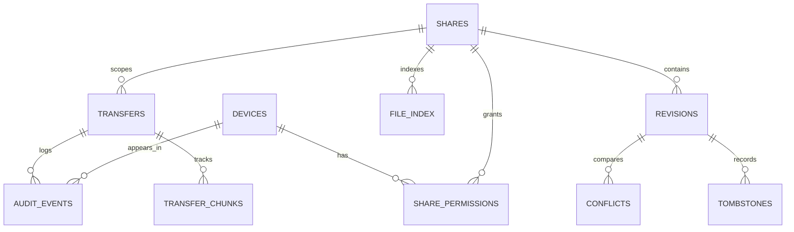

# Database Entity Relationships

```mermaid
erDiagram
    DEVICES ||--o{ SHARE_PERMISSIONS : has
    SHARES ||--o{ SHARE_PERMISSIONS : grants
    SHARES ||--o{ REVISIONS : contains
    SHARES ||--o{ FILE_INDEX : indexes
    SHARES ||--o{ TRANSFERS : scopes
    TRANSFERS ||--o{ TRANSFER_CHUNKS : tracks
    REVISIONS ||--o{ TOMBSTONES : records
    REVISIONS ||--o{ CONFLICTS : compares
    TRANSFERS ||--o{ AUDIT_EVENTS : logs
    DEVICES ||--o{ AUDIT_EVENTS : appears_in
```
