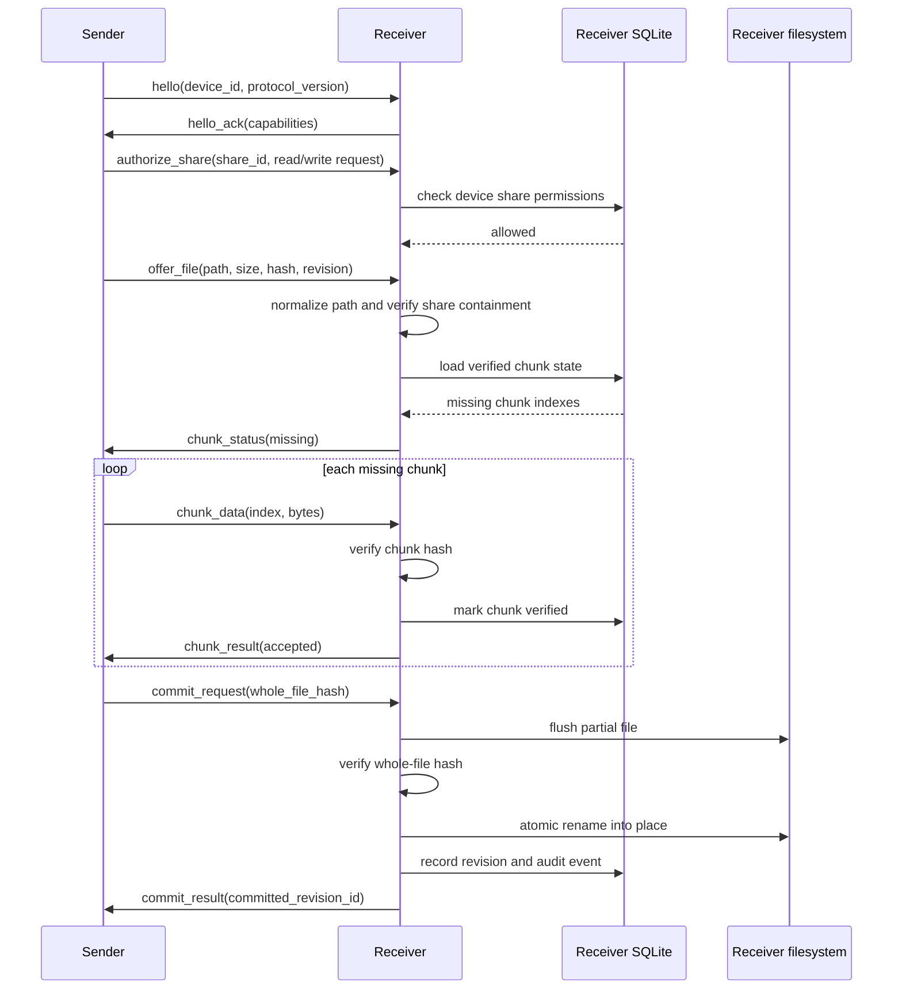

# File Transfer Sequence

```mermaid
sequenceDiagram
    participant Sender
    participant Receiver
    participant Store as Receiver SQLite
    participant FS as Receiver filesystem

    Sender->>Receiver: hello(device_id, protocol_version)
    Receiver->>Sender: hello_ack(capabilities)
    Sender->>Receiver: authorize_share(share_id, read/write request)
    Receiver->>Store: check device share permissions
    Store-->>Receiver: allowed
    Sender->>Receiver: offer_file(path, size, hash, revision)
    Receiver->>Receiver: normalize path and verify share containment
    Receiver->>Store: load verified chunk state
    Store-->>Receiver: missing chunk indexes
    Receiver->>Sender: chunk_status(missing)
    loop each missing chunk
        Sender->>Receiver: chunk_data(index, bytes)
        Receiver->>Receiver: verify chunk hash
        Receiver->>Store: mark chunk verified
        Receiver->>Sender: chunk_result(accepted)
    end
    Sender->>Receiver: commit_request(whole_file_hash)
    Receiver->>FS: flush partial file
    Receiver->>Receiver: verify whole-file hash
    Receiver->>FS: atomic rename into place
    Receiver->>Store: record revision and audit event
    Receiver->>Sender: commit_result(committed_revision_id)
```
