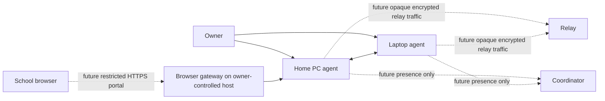

# System Context

```mermaid
flowchart LR
    Owner["Owner"] --> Home["Home PC agent"]
    Owner --> Laptop["Laptop agent"]
    Home <--> Laptop
    Home -. "future opaque encrypted relay traffic" .-> Relay["Relay"]
    Laptop -. "future opaque encrypted relay traffic" .-> Relay
    Home -. "future presence only" .-> Coord["Coordinator"]
    Laptop -. "future presence only" .-> Coord
    School["School browser"] -. "future restricted HTTPS portal" .-> Portal["Browser gateway on owner-controlled host"]
    Portal --> Home
```
