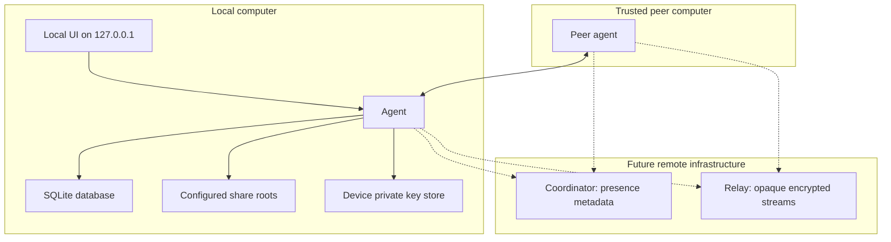

# Trust Boundaries

```mermaid
flowchart TD
    subgraph Local["Local computer"]
        UI["Local UI on 127.0.0.1"]
        Agent["Agent"]
        DB["SQLite database"]
        Shares["Configured share roots"]
        Secrets["Device private key store"]
        UI --> Agent
        Agent --> DB
        Agent --> Shares
        Agent --> Secrets
    end

    subgraph Peer["Trusted peer computer"]
        PeerAgent["Peer agent"]
    end

    subgraph RemoteInfra["Future remote infrastructure"]
        Coord["Coordinator: presence metadata"]
        Relay["Relay: opaque encrypted streams"]
    end

    PeerAgent <--> Agent
    Agent -.-> Coord
    Agent -.-> Relay
    PeerAgent -.-> Coord
    PeerAgent -.-> Relay
```
