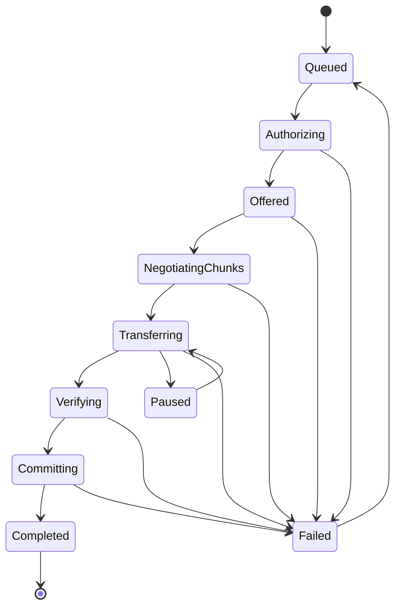

# Transfer Protocol Outline

The Phase 1 protocol is a peer-to-peer request/response protocol running over an authenticated transport session. The direct TCP implementation provides a paired mutual-TLS stream for that connection; the transfer protocol is responsible for file manifests, chunk negotiation, chunk verification, authorization, and commit state. This does not claim file-level or relay end-to-end encryption.

## Message Families

- `hello`: protocol version, device ID, session capabilities, transfer limits.
- `authorize_share`: share ID, requested capability, path scope.
- `offer_file`: relative path, size, file hash, hash algorithm, chunk size, source revision.
- `chunk_manifest`: ordered chunks with index, offset, size, and chunk hash.
- `chunk_status`: receiver-owned state for chunks already verified.
- `chunk_data`: chunk index and bytes.
- `chunk_result`: accepted, rejected, duplicate, unauthorized, or retry later.
- `commit_request`: complete file hash and source revision metadata.
- `commit_result`: committed revision ID or failure reason.
- `transfer_cancel`: idempotent cancellation.

## Required Properties

- Every transfer has a stable `transfer_id`.
- Duplicate messages are tolerated.
- Reordered chunks are tolerated.
- A verified chunk is never trusted solely because it was received.
- A completed file is verified before commit.
- Destination commit is atomic.
- The receiver enforces share authorization.
- A source file that changes during transfer invalidates the attempt.
- Path traversal attempts fail before any file write.

## State Machine

## Serialization

Protocol Buffers are the preferred future serialization format. Until the schema is added, protocol structs must remain small, versioned, and strictly validated at boundaries.
